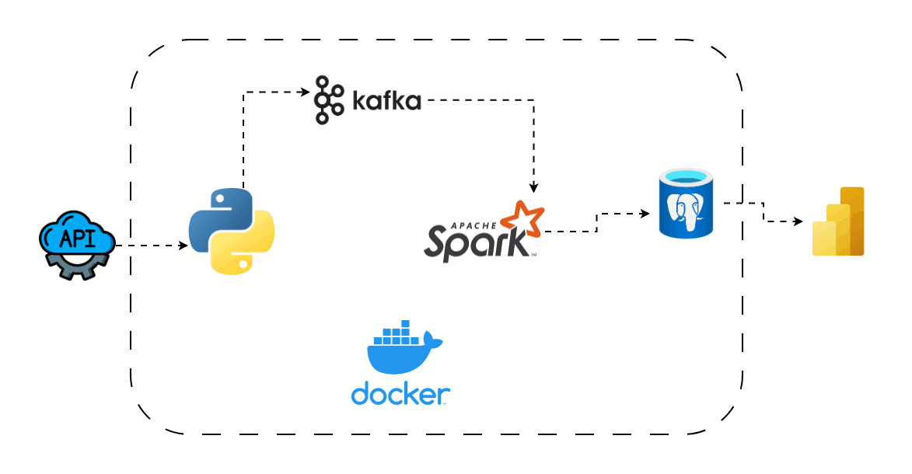
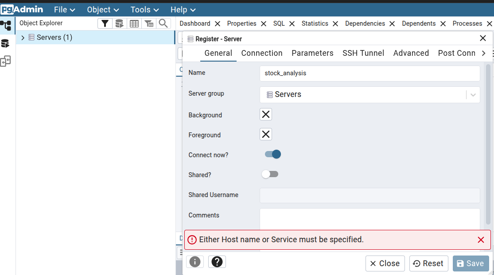
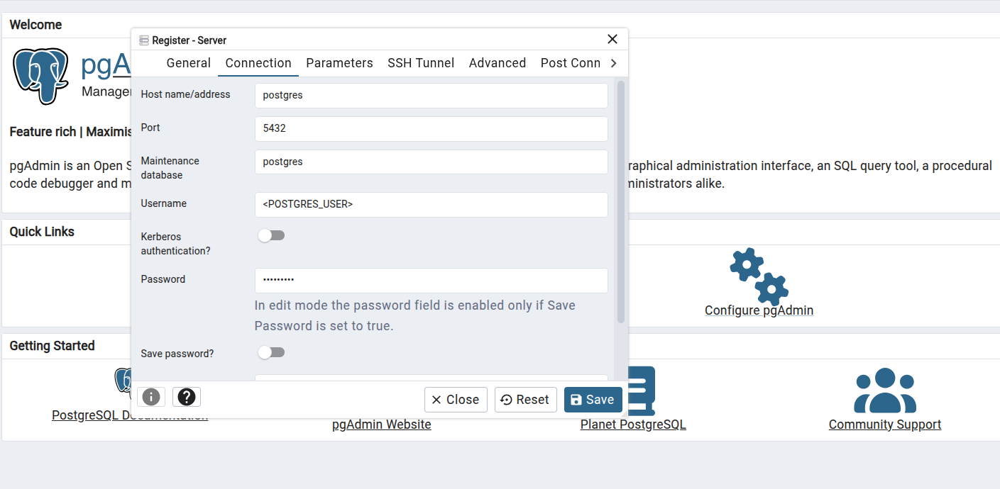
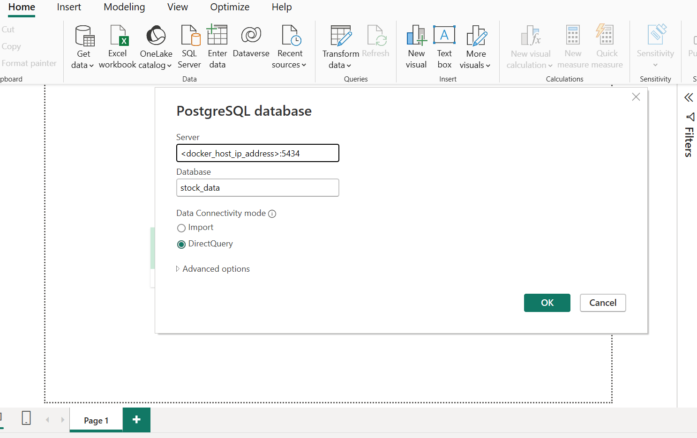
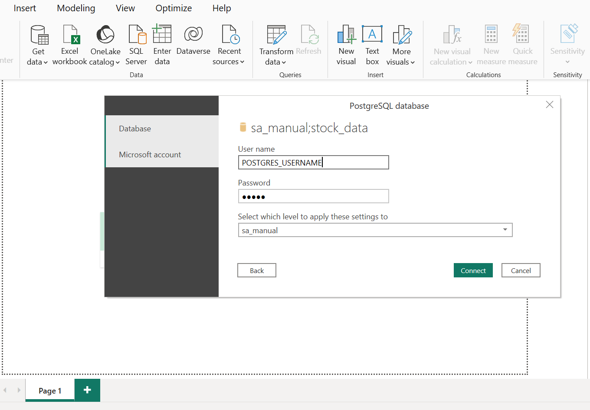
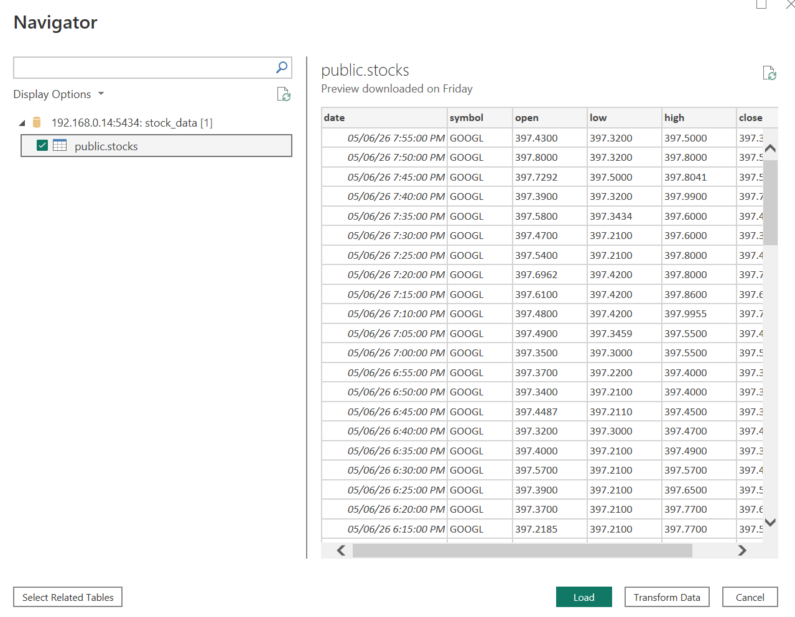

## Real Time Stock Market Analysis


### Data Pipeline Architecture


# Table of Contents

- [Project Overview](#project-overview)
- [Business Understanding](#business-understanding)
  - [Business Challenge](#business-challenge)
  - [Project Objectives](#project-objectives)
  - [Project Deliverables](#project-deliverables)
  - [Data Source](#data-source)
- [Architecture Overview](#architecture-overview)
- [Technology Stack](#technology-stack)
- [Project Structure](#project-structure)
- [Prerequisites](#prerequisites)
- [Project Setup](#project-setup)
  - [1. Clone The Repository](#1-clone-the-repository)
  - [2. Create Environment Variables](#2-create-environment-variables)
  - [3. Create Virtual Environment](#3-create-virtual-environment)
  - [4. Install Required Packages](#4-install-required-packages)
  - [5. Run Docker Containers](#5-run-docker-containers)
- [Docker Networking & PostgreSQL Port Exposure](#docker-networking--postgresql-port-exposure)
- [Accessing Services](#accessing-services)
- [PostgreSQL Setup](#postgresql-setup)
  - [6. Connect To pgAdmin](#6-connect-to-pgadmin)
  - [Create Database](#create-database)
  - [Create Stocks Table](#create-stocks-table)
- [Producer Pipeline](#producer-pipeline)
  - [7. Start Producer](#7-start-producer)
- [Consumer Pipeline](#consumer-pipeline)
  - [8. Spark Consumer Processing](#8-spark-consumer-processing)
  - [Monitor Consumer Logs](#monitor-consumer-logs)
  - [Verify Data In PostgreSQL](#verify-data-in-postgresql)
- [Connecting Power BI To PostgreSQL](#connecting-power-bi-to-postgresql)
  - [External Power BI Connection Setup](#external-power-bi-connection-setup)
  - [Step 1: Expose PostgreSQL Port](#step-1-expose-postgresql-port)
  - [Step 2: Allow Firewall Access (Linux UFW)](#step-2-allow-firewall-access-linux-ufw)
  - [Step 3: Get Host Machine IP Address](#step-3-get-host-machine-ip-address)
  - [Step 4: Configure PostgreSQL Network Access](#step-4-configure-postgresql-network-access)
  - [Step 5: Connect Power BI](#step-5-connect-power-bi)
- [Common Connection Issues](#common-connection-issues)
- [Useful Docker Commands](#useful-docker-commands)
  - [View Running Containers](#view-running-containers)
  - [Start Docker Desktop (Linux)](#start-docker-desktop-linux)
  - [Stop Services](#stop-services)
  - [Remove Containers and Volumes](#remove-containers-and-volumes)
- [Future Improvements](#future-improvements)
- [Conclusion](#conclusion)

## Project Overview

MarketPulse Analytics is a financial services firm based in New York City specializing in:

> - Real-time stock market analysis
> - Financial forecasting
> - Trading strategy optimization
> - Market trend monitoring

This project implements a scalable, real-time data engineering platform that streams live stock market data from an API endpoint through Kafka, processes the data using Spark, stores the results in PostgreSQL, and visualizes analytics using Power BI Desktop.

## Business Understanding
### Business Challenge
1. Increasing Customer Demand for Advanced Insights

Clients require:

> - Predictive stock price analysis
> - Real-time market insights
> - Portfolio performance analytics
> - Sentiment and trend analysis

2. Scalability Issues

The existing infrastructure struggles to:

> - Handle increasing market data volume
> - Process high-frequency stock updates
> - Scale during market spikes and earnings releases

This creates delays in generating client-facing analytics.

3. Data Latency

The current reporting system experiences:

> - Delayed stock updates
> - Slow processing pipelines
> - Integration bottlenecks across multiple sources

This negatively impacts:

> - Decision-making
> - Trading responsiveness
> - Client trust

## Project Objectives

### Primary Goals

#### Develop a Scalable Real-Time Data Pipeline

Implement a distributed streaming architecture using:

> - Apache Kafka
> - Apache Spark
> - Dockerized microservices

to ensure:

> - fault tolerance
> - scalability
> - low latency
> - high availability

#### Improve Data Accuracy and Timeliness

Reduce processing delays by:

> - streaming data in real time
> - optimizing ingestion workflows
> - minimizing transformation bottlenecks
> - Build an Analytics Dashboard

Develop a live reporting dashboard using Power BI Desktop to visualize:

> - stock trends
> - trading activity
> - market performance
> - financial metrics

## Project Deliverables

The final solution enables MarketPulse Analytics to:

> - Deliver real-time stock market intelligence
> - Improve reporting performance
> - Scale efficiently under high market load
> - Maintain competitive advantage within the financial analytics industry

## Data Source
[Alpha Vintage API](https://rapidapi.com/alphavantage/api/alpha-vantage/playground/apiendpoint_55220bb2-8a64-4cde-89e1-87ec00947f57)

## Technology Stack
| Component	| Purpose |
| --- | --- | 
| [Python](https://www.python.org/)	| Producer application|
| [Apache Kafka](https://kafka.apache.org/)	| Real-time event streaming|
| Kafka UI	| Kafka topic inspection |
| [Apache Spark](https://spark.apache.org/)	| Stream processing |
| [PostgreSQL](https://www.postgresql.org/)	| Analytical data storage
| [pgAdmin](https://www.pgadmin.org/)	| PostgreSQL management
| [Docker](https://www.docker.com/) & [Docker Compose](https://docs.docker.com/compose/)	| Container orchestration |
| [Power BI Desktop](https://www.microsoft.com/en-us/power-platform/products/power-bi)	| Data visualization & reporting

## Project Structure

```text
Real-Time-Stock-Market-Analysis/
│
├── producer/
│   └── main.py
│
├── consumer/
│
├── docker-compose.yml
├── requirements.txt
├── .env
└── README.md
```

### Prerequisites

Before starting, ensure the following are installed:

> - Docker Desktop
> - Python 3.10+
> - PostgreSQL Client Tools
> - Git
> - Power BI Desktop

## Project Setup
### 1. Clone The Repository
``` bash
git clone https://github.com/NwaObed/Market-Pulse.git

cd Market-Pulse
```
## Environment Configuration
### 2. Create Environment Variables

Create a ```.env``` file in the project root:

``` bash
API_KEY=ADD_API_KEY

POSTGRES_USER=<username>
POSTGRES_PASSWORD=<user_passwword>

PGADMIN_DEFAULT_EMAIL=<sample@admin.com>
PGADMIN_DEFAULT_PASSWORD=<samplePwd>
```

## Python Environment Setup

### 3. Create Virtual Environment

### Linux / MacOS

```python 
python3 -m venv venv
source venv/bin/activate
```

### Windows
```python
python -m venv venv
venv\Scripts\activate
```

## Install Dependencies

### 4. Install Required Packages
```python
pip install -r requirements.txt
```

## Start Docker Services
### 5. Run Docker Containers

Start all services:

```bash 
docker compose up -d
```

### Verify Running Containers
``` docker ps```

On your docker desktop, you should see containers for:

> - Kafka
> - Kafka UI
> - Spark
> - PostgreSQL
> - pgAdmin

## Docker Networking & PostgreSQL Port Exposure

The PostgreSQL container is exposed externally using Docker port mapping.

Example Docker mapping:

```bash 0.0.0.0:5434->5432/tcp```

This means:

| Host Machine | Docker Container |
| --- | --- |
| Port 5434 | Port 5432 |
> - PostgreSQL runs internally on container port 5432
> - External clients connect using host port 5434
## Accessing Services
| Service	| URL |
| ---| ---|
| pgAdmin |	http://localhost:8080:80 |
| Kafka UI |	http://localhost:8085 |

## PostgreSQL Setup
### 6. Connect To pgAdmin

Open:

```http://localhost:8080:80```

Login using:

```bash 
Email: <sample@admin.com>
Password: <samplePwd>
```

### Create Server

Once login on `pgadmin`, 
> - Right click on `Servers`

> - Click `Register` > `Servers...`

> 

> - Enter preferred server name eg `stock_analysis`

> 

> - Enter `postgres` as host name

> - Click `Save`


### Create Database

Inside pgAdmin:

Create database:

```stock_data```

### Create Stocks Table
```sql 
CREATE TABLE stocks (
    id SERIAL PRIMARY KEY,
    symbol VARCHAR(20),
    price NUMERIC,
    volume BIGINT,
    timestamp TIMESTAMP
);
```

## Producer Pipeline
### 7. Start Producer

Run the producer script:

```python 
python producer/main.py
```

This script:

> - fetches stock market data from the API
> - converts records into JSON events
> - pushes events into Kafka topic: `stock_analysis`

## Consumer Pipeline
### 8. Spark Consumer Processing

Spark consumes Kafka messages and:

> - processes streaming events
> - transforms stock records
> - loads processed data into PostgreSQL

## Monitor Consumer Logs

Use Docker Desktop or terminal:

```docker logs <consumer_container_name>```

## Verify Data In PostgreSQL

Run:

```sql 
SELECT * FROM stocks;
```

Example query:

```sql
SELECT *
FROM stocks
WHERE symbol = 'GOOGL';
```

### Connecting Power BI To PostgreSQL

#### External Power BI Connection Setup

In this project:

> - PostgreSQL runs inside Docker on Laptop A
> - Power BI Desktop runs externally on Laptop B

To allow external access:

> - Docker port 5434 was exposed
> - Firewall rules were configured
> - PostgreSQL networking was enabled

### Step 1: Expose PostgreSQL Port

Docker container exposes PostgreSQL using:

```5434:5432```

Meaning:

> - Host port: 5434
> - Container port: 5432

### Step 2: Allow Firewall Access (Linux UFW)

On the Docker host machine:

```bash sudo ufw allow 5434/tcp
sudo ufw reload
```

### Step 3: Get Host Machine IP Address

On the Docker/Postgres machine:

```hostname -I```

Example output:

```192.168.1.xxx```

### Step 4: Configure PostgreSQL Network Access

Inside PostgreSQL configuration:

##### postgresql.conf

```listen_addresses = '*'```

##### pg_hba.conf

```host all all 0.0.0.0/0 md5```

Restart PostgreSQL after changes.

### Step 5: Connect Power BI

> - Open Power BI Desktop

> - Click ```Blank Report```

> - Click `Get data`

> - Click `More` then search and select `PostgreSQL database`

> - Click `Connect`

> 

Use 
```bash
Server: <docker_host_ip_address>:5434
Database: stock_data
Username: <postgres_username>
Password: <your_password>
```
> - Click `OK`

> 

> - Click `Connect`

> 

> - Click `Load` or `Transform` if you want to perform further transformations.

### Common Connection Issues
|Issue	| Cause	| Solution|
| ---   | --- | --- |
|database does not exist |	Wrong PostgreSQL instance |	Connect to correct Docker port |
| authentication failed | Invalid credentials	| Reset PostgreSQL password |
no such host is known	| Wrong IP/hostname	| Use host machine IP |
connection timed out	| Firewall blocked	| Open port using UFW |
Docker daemon unavailable	| Docker Desktop not running	| Start Docker Desktop |

### Useful Docker Commands

#### View Running Containers

```docker ps```

#### Start Docker Desktop (Linux)

```systemctl --user start docker-desktop```

#### Stop Services

```docker compose down```

#### Remove Containers and Volumes

```docker compose down -v```

#### Future Improvements

###### Potential enhancements include:

> - Sentiment analysis integration
> - Machine learning forecasting
> - Real-time alerting system
> - Airflow orchestration
> - Kubernetes deployment
> - Cloud-native scaling
> - CI/CD automation

### Conclusion

This project demonstrates a complete real-time financial analytics platform capable of:

> - ingesting live market data
> - processing streaming events
> - storing analytical records
> - enabling external BI visualization
> - scaling using distributed technologies